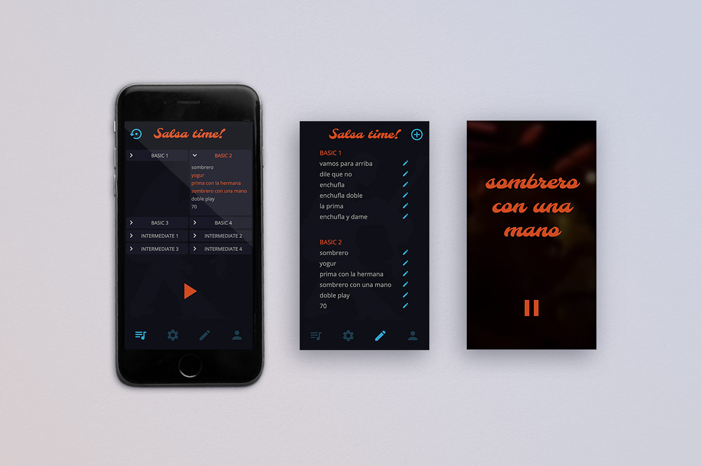

#
# Salsa time! - Learn Rueda de Casino
 

## <code>Description</code>

### Indroduction
 
At the Rueda De Casino, the moves of Cuban Salsa are danced in a group. The dance couples form a circle, the announcer spontaneously calls out a command and the couples perform these figures synchronously and/or exchange partners.    
The whole thing is not a choreography, it happens out of the spontaneity of the announcer.
With up to 200 dance figures, a lot of training is required to master the dance figures and to have the appropriate move ready when it's called up.    

### What does the app?
The application simulates this announcer. To drill the reaction and the dance figures you make a selection of moves. In the session it calls up a random one and after a break, whose length depends on the size of this figure, the next.

### Features
- Create, update, delete moves
- Audio files for each move name are created by google-text-to-speech plugin
- Make a selection of moves to train
- Youtube videos for moves are callable if available
- In session mode selected moves are called randomly both visually and acoustically

---

 

# 

### <code>Demo</code>

A hosted version can be found here:
[salsa-time.herokuapp.com](https://salsa-time.herokuapp.com/)

## <code>Tech Stack</code>

- React
- React Router
- React Hooks
- Styled Components
- Node.js
- Express
- Heroku
- Styleguidist
- Jest
- Cypress

## <code>Project setup</code>

- Clone this repository
- Enter the created folder:
<code>cd &lt;repoitory name&gt;</code>
- Install all npm dependencies server side:
<code>npm install</code>
- Install all npm dependencies client side:
<code>cd client && npm install && cd..</code>

- Create on [www.mongodb.com](https://www.mongodb.com/) a database called 'salsaApp'
- Copy its connection string
- Create a <code>.env</code> file on project root level and asign the connection string to a <code>ATLAS_URI</code> key

- Start server and client:
<code>npm run dev</code>

- To run Styleguidist use <code>npm run styleguide</code>
- To run Jest unit tests use <code>npm test</code>
- To run Cypress tests use <code>npm run cypress</code>